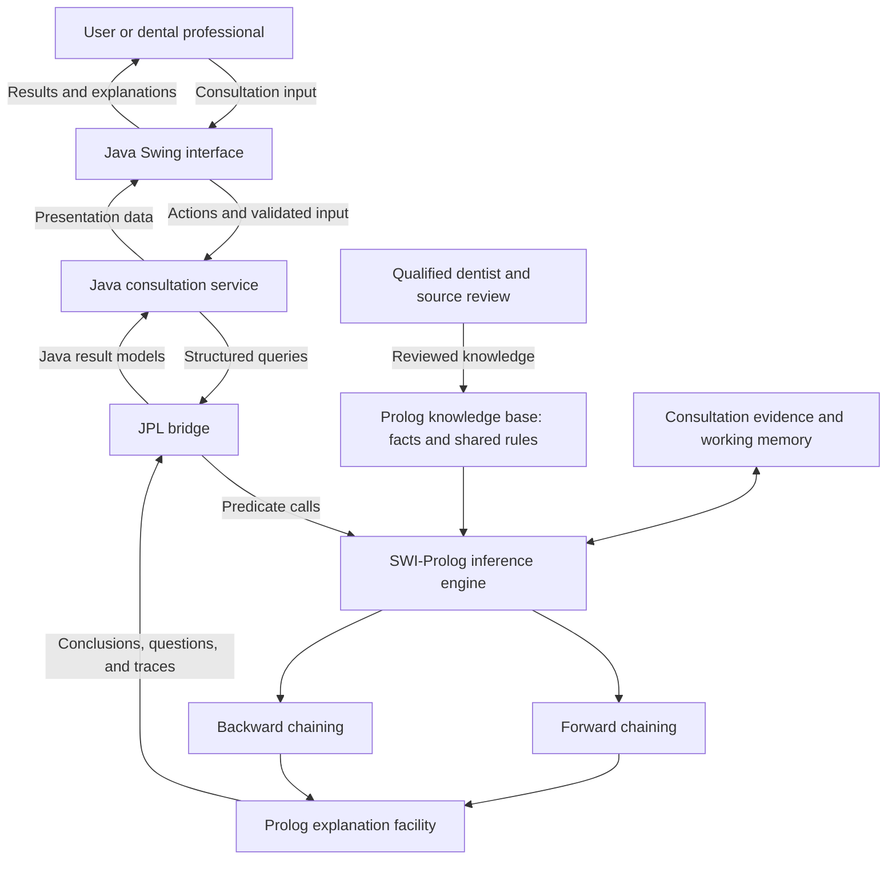

# DentalExplain architecture

**Status:** Selected architecture; application and packaging are not implemented yet.

DentalExplain will use **Java Swing for its desktop interface, JPL for Java–Prolog integration, and SWI-Prolog for its knowledge base and inference engine**. The intended deliverables are a macOS application and a Windows application with an executable launcher. Clicking the application icon will open the consultation interface.

The domain, expert-review requirements, and agreed target of **25 meaningful rules and 40 authored domain facts** are described in the [project proposal](project-proposal.md).

## 1. Technology decision

| Responsibility | Selected technology | Reason |
| --- | --- | --- |
| Desktop interface | Java Swing | Suitable for consultation forms, follow-up questions, results, and rule-trace views; included in the Java desktop module. |
| Integration | JPL | Dedicated bridge for calling SWI-Prolog predicates and retrieving structured terms from Java. |
| Knowledge base | SWI-Prolog | Stores reusable domain facts and rules with identifiers and provenance. |
| Inference engine | SWI-Prolog | Implements explicit forward and backward chaining over the same knowledge. |
| Explanation generation | SWI-Prolog | Produces evidence and rule traces from actual reasoning; Java presents them. |
| Desktop packaging | `jpackage` | Produces a native launcher and application package with a Java runtime and icon. Prolog/JPL dependencies must be included separately. |

Java is chosen because the application can share its UI and integration source across macOS and Windows while offering a dedicated desktop window. For this assignment, Swing provides sufficient controls without adding JavaFX's separate runtime dependencies.

C++/Qt could also supply a desktop application, but introduces more native build and deployment work for this project. XPCE and a terminal UI are alternatives rather than the selected user interface.

A local web interface could also be opened by an icon that starts a server and browser. The icon requirement therefore does not technically rule it out. We are choosing a Java desktop interface because it matches the preferred application experience; the selected design needs no browser or HTTP server.

## 2. Component structure

### Java interface and consultation service

The interface will provide age and dentition input, symptom/history/finding forms, a reasoning-mode choice, follow-up questions, results, an explanation view, and new-consultation/reset controls. It will distinguish unknown answers from negative answers and reported symptoms from supplied examination findings.

Java handles input format validation, navigation, and presentation. A consultation service owns the current consultation and coordinates calls to Prolog. It converts structured Prolog results into Java models instead of parsing display text.

### JPL integration boundary

JPL embeds access to the Prolog engine within the Java application through JNI and native SWI-Prolog libraries. It is not a pure-Java Prolog implementation. The Java library and native components must come from a compatible JPL/SWI-Prolog distribution. See the [official JPL project](https://github.com/SWI-Prolog/packages-jpl).

Use JPL term objects to construct predicate arguments and read results, rather than concatenating user-entered text into executable Prolog queries. Keep query construction, error handling, and result conversion in one integration layer. Close queries after use. See the [JPL Java API overview](https://jpl7.org/JavaApiOverview).

### Prolog knowledge, reasoning, and explanations

Prolog owns clinical rule applicability, age-group interpretation, candidate support, intermediate conclusions, and explanations. Java must not duplicate these decisions. Age boundaries and diagnostic rules remain pending dental-source research and expert review.

The knowledge base is reusable across consultations. Working memory is consultation-specific and contains observations and derived conclusions; it does not count toward the 40 authored facts.

Forward chaining repeatedly applies satisfied rules until no new conclusions follow, recording fired rules and avoiding repeated derivations. Backward chaining evaluates a candidate condition's supporting rules and asks for missing evidence. Both read the shared rule base.

The explanation facility records rule identifiers, supporting observations, intermediate conclusions, age/dentition applicability, and unmet premises. It supplies both “how was this result reached?” and “why is this question needed?” content.

## 3. Consultation data flow and lifecycle

1. The native application launcher starts the bundled Java runtime and opens the Swing window.
2. Initialization locates packaged Prolog resources and native libraries, initializes JPL/SWI-Prolog, and loads the knowledge and inference modules. The UI becomes ready only after initialization succeeds.
3. The user starts a consultation and supplies age, relevant dentition information, symptoms, history, and available findings.
4. Java validates input formats and passes structured evidence to Prolog through JPL.
5. The selected reasoning mode returns conclusions, missing-evidence questions, and explanation traces. Additional answers are added to the current consultation before reasoning continues.
6. Java presents the returned results and traces without inventing diagnostic explanations or confidence percentages.
7. Reset clears consultation observations, derived conclusions, and traces while retaining the reusable knowledge base. Exit closes active queries and application resources.

Prolog initialization and reasoning will run outside Swing's event-dispatch thread. Serialize consultation operations through one background worker and update Swing components on the event-dispatch thread. Prevent overlapping reasoning/reset actions and ensure an old result cannot overwrite a new consultation. This follows Swing's separation of UI and background work; see [Oracle's Swing concurrency guidance](https://docs.oracle.com/javase/tutorial/uiswing/concurrency/index.html).

Resolve packaged files relative to the installed application, not the user's current working directory. A shortcut launch must work just as reliably as a terminal launch.

## 4. Cross-platform delivery

**Shared source code does not mean one dependency-free JAR.** The Java application can be shared across supported platforms, but its JVM, SWI-Prolog runtime, and JPL native libraries must match the operating system and processor architecture.

| Deliverable | Intended use | Dependencies |
| --- | --- | --- |
| Application JAR | Additional developer artifact | Compatible Java, SWI-Prolog/JPL native libraries, Prolog modules, and configured resource/library paths. |
| macOS `DentalExplain.app` | Main macOS deliverable; launch by icon | Bundled Java runtime, application/JPL JARs, Prolog modules, matching native libraries, and other required Prolog resources. |
| Windows application image | Main portable Windows bundle; launch `DentalExplain.exe` | The executable together with its bundled runtime, libraries, Prolog modules, and resources. Distribute the complete directory, such as in a ZIP. |
| Windows `.exe` installer | Optional installation deliverable | Installs the complete application and can create a shortcut. The installer differs from the installed launcher. |

The final package should require no manual Java or SWI-Prolog installation on the target machine. This is an acceptance goal, not a verified capability today. A launcher `.exe` by itself is insufficient; the accompanying application files must be distributed.

### Planned packaging process

1. Pin a compatible JDK, SWI-Prolog, and JPL combination and verify a minimal Java-to-Prolog query on each target platform before building the full UI.
2. Compile the shared Java application, include `jpl.jar`, and stage the Prolog modules, runtime resources, and platform-specific native dependencies. Keep compatible Java and native binaries for each target architecture.
3. Use `jpackage --type app-image` to create and test the application image, including an application icon and native-library/resource configuration. Ensure the Java runtime includes Swing's `java.desktop` module.
4. Test the complete image by clicking its launcher. Only then produce an installer or distribution archive if required.
5. Include the relevant redistribution notices and the installation/launch instructions in the eventual release.

`jpackage` creates a Java runtime and supports native application packaging, but it does not automatically discover and bundle SWI-Prolog/JPL dependencies. Application packages must be built on their target platform. Windows installer tooling depends on the pinned JDK's requirements. See [Oracle's packaging overview](https://docs.oracle.com/en/java/javase/25/jpackage/packaging-overview.html).

Development can take place on the Mac, with a Windows GitHub Actions build planned for the Windows artifact. A separate macOS build produces the Mac artifact. CI can check compilation, integration, and packaging, but a complete GUI consultation and icon launch still need verification on each intended target machine.

Exact JDK/Prolog versions, supported OS versions and CPU architectures, installer format, and CI configuration remain to be pinned during the integration and packaging feasibility check. No claim is made that a macOS package runs on Windows or that all Macs/Windows machines are already supported.

## 5. Failure handling and verification

| Scenario | Required behavior or check |
| --- | --- |
| Missing or incompatible native dependency | Show an actionable initialization error identifying the failed component; do not enable reasoning as if initialization succeeded. |
| Prolog exception or malformed integration result | Report an application/integration error separately from a valid “no supported conclusion” result. |
| Unknown or contradictory consultation evidence | Preserve uncertainty or identify the conflict; do not silently turn unknown into false. |
| Repeated reasoning and reset | No duplicate conclusions, stale UI results, or evidence carried into another consultation. |
| Explanation display | Display actual rule/evidence traces and missing-premise reasons returned by Prolog. |
| UI responsiveness | The window remains responsive during initialization and reasoning. |
| Cross-platform integration | Verify JPL initialization, module loading, both reasoning modes, result conversion, and query cleanup on macOS and Windows. |
| Packaged application | On a clean target machine with no separately installed Java/Prolog, launch by icon, complete a case, view explanations, reset, and exit. Also test paths containing spaces. |

Reasoning correctness will be tested in Prolog; Java integration and packaged-launch tests will verify the desktop boundary. The [proposal's test plan](project-proposal.md#7-test-and-acceptance-plan) covers clinical case expectations and chaining agreement.

This document records the selected technical architecture. It does not claim that a working application, executable, clinical knowledge base, expert review, or passing tests already exist.
