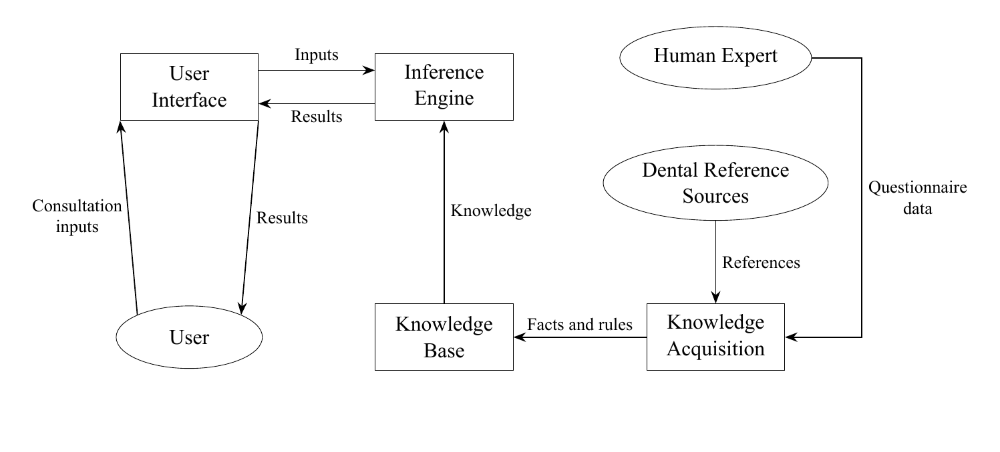

# DentalExplain architecture

**Status:** First Java Swing/JPL desktop implementation, application version 1.1.0, knowledge version 0.3.0. Automated builds and software checks pass on macOS ARM64, Windows x64 and Ubuntu 24.04 x64; native manual checks were performed on the development Mac on 29 September 2026. Clinical expert review is pending.

See the [proposal](project-proposal.md), [20 acceptance cases](test-cases.md), [user manual](user-manual.md), [report](report.md), and [verification record](verification.md). The human expert is Kushala Jayawickrama, final-year fifth-year Dental Surgery undergraduate, University of Peradeniya. The expert questionnaire in report Appendix B is conducted with Kushala, as confirmed by the project author; clinical approval remains pending.

## 1. Technology decision

Java Swing supplies the native desktop interface. Java 21 calls SWI-Prolog 10.0.2 through the matching vendor JPL Java and JNI libraries. A `jpackage` application image bundles Java, the application, Prolog modules and native dependencies. Opening its icon opens the interface without a terminal or a separately installed Prolog runtime.

| Option | Integration, advantages and tradeoffs | Delivery |
| --- | --- | --- |
| **Java Swing — selected** | JPL structured terms; standard Java desktop controls; shared Java source across platforms. JNI and Prolog binaries still need platform-specific packaging. JavaFX would require an additional GUI runtime. | Development JAR plus native `jpackage` image. macOS, Windows x64 and Ubuntu x64 packages; actual checks recorded separately. |
| C++/Qt | Embed through SWI's C++ interface. Native UI and strong platform integration, but more C++/Qt/native build dependencies and deployment work. | Separate Qt/Prolog bundles per platform. |
| Local web | SWI HTTP server with HTML/CSS/JavaScript. A launcher could start it and open a browser; an icon requirement does not technically exclude it. | Server, assets and runtime plus browser launcher. Not selected. |
| Prolog XPCE | GUI and knowledge in Prolog; fewer language boundaries, but different GUI tooling and runtime resources. | XPCE/Prolog runtime bundle. |
| Terminal | Direct Prolog consultation; useful for reasoning tests and development. | Script plus Prolog runtime; not the delivered consultation interface. |

Official references: [Swing](https://docs.oracle.com/javase/tutorial/uiswing/), [JPL](https://github.com/SWI-Prolog/packages-jpl), [SWI C++ interface](https://www.swi-prolog.org/pldoc/man?section=cpp2), [SWI HTTP](https://www.swi-prolog.org/pldoc/man?section=http), [XPCE](https://www.swi-prolog.org/packages/xpce/), and [Java 21 jpackage](https://docs.oracle.com/en/java/javase/21/jpackage/packaging-overview.html).

A shell script requires its interpreter and dependencies. A `.jar` contains Java classes and needs Java; this application's JAR also needs JPL and native Prolog files. A native launcher (`.app` on macOS or `.exe` on Windows) starts the bundled application; distribute its complete bundle. An installer installs that bundle and can create shortcuts. A Mac build cannot supply a verified Windows executable. A single JAR is not a dependency-free cross-platform deliverable.

## 2. Component structure



The [TikZ source](report-assets/architecture.tex) shows consultation inputs and results between User, User Interface and Inference Engine. Knowledge flows from the Knowledge Base to the Inference Engine. Human Expert questionnaire data and Dental Reference Sources pass through Knowledge Acquisition into the Knowledge Base. Technology details follow below.


### Java interface and consultation service

`App.java` owns the welcome → setup → reported symptoms (step 1) → relevant findings (step 2) → results flow and read-only knowledge workspace. `AnswerControl.java` builds every clinical field from the shared Prolog question catalogue. Back navigation preserves active selections. Conditional fields reset to Unknown when hidden and are excluded from submitted observations. A new consultation clears fields and results.

Clinical controls are non-editable dropdowns, radio groups or checkbox groups. Search in the knowledge workspace is the only editable text input; it is not clinical evidence. Dropdown keyboard type-ahead selects an existing option; it cannot create a new value. The form has accessible labels, focusable controls, button mnemonics, Tab traversal and native Mac editing shortcuts for knowledge search.

A single background executor initializes Prolog, routes questions and performs reasoning. The catalogue is loaded before the interface becomes ready; subsequent tab viewing reads cached records. Swing updates occur on the event-dispatch thread. A generation token invalidates pending callbacks after edits, navigation or reset, preventing delayed results from replacing a new consultation. See [Swing concurrency guidance](https://docs.oracle.com/javase/tutorial/uiswing/concurrency/index.html).

### JPL integration boundary

`Bridge.java` constructs `Atom`, numeric, list and `Compound` terms and closes each query. Labels never become clinical query text. The native libraries, boot image and modules are resolved relative to `dental.home`; `jpackage` sets that to its application directory. No Prolog process, HTTP server or command-line shell participates in an assessment.

```prolog
assess(Observations,
       result(Status, CandidateIds, MissingQuestionIds, Messages)).
% Observations: [obs(age_group,adolescent),obs(triggers,[cold]), ...]
% Java boundary: Bridge.assess(answers)
active_questions(Observations, Stage, QuestionIds).
% Stage: setup | symptoms | findings
% Java: Bridge.activeQuestions(answers, stage)
catalog(questions, Records).
catalog(facts, Records).
catalog(rules, Records).
catalog(conditions, Records).
catalog(version, [Version]).
catalog(question_sources, Records).
```

Prolog validates the list shape, ground identifiers/values, schema membership, unique keys and predefined age-group atoms before inference. Duplicate or arbitrary fields cannot bypass controlled UI input. Contradictory pain answers and incompatible tooth selections return conflicts.

### Prolog knowledge and reasoning

`domain.pl` contains exactly **30 `domain_fact/5` records and 25 `rule/5` production rules**, with sources and pending review. Questions, condition labels, IDs, source metadata, observation lists and test fixtures are excluded from these counts. `questions.pl` contains 30 questions with control types, labels, explicit allowed values and conditional visibility. Display labels map directly to stable atoms or numbers; checkbox lists expand only explicitly selected items to presence. None maps all group items to No; unchecked items otherwise remain Unknown. Not applicable stays distinct and cannot satisfy a required clinical premise.

`engine.pl` forward chaining repeatedly evaluates rule premises and adds unique conclusions until the sorted conclusion set stops changing. The finite rule conclusions guarantee termination. Intermediate deductions exist only within the current inference call.

**Forward chaining is the selected method.** Consultations begin with reported evidence and dentist-supplied findings. The engine evaluates all five conditions, permits coexisting candidates, and does not require the dentist to nominate a diagnosis. This evidence-first workflow suits forward chaining better than investigating a selected goal. This decision replaces the earlier requirement to implement both forward and backward chaining; backward processing and target filtering have been removed.

After confirmed deductions reach a fixed point, a second forward pass propagates unresolved prerequisite sets across every unblocked rule until stable. A known false premise blocks the whole rule, including its pending-input requests. Unknown and Not applicable cannot establish a premise; their question identifiers propagate through intermediate deductions. Internal gum/warning identifiers map back to their public checkbox question. When an unanswered gate hides a follow-up, requests point to that parent first. Alternative rule branches carry their own pending sets. Missing inputs are collected only for candidates not already supported. This pass does not recursively prove candidate goals. Finite rule conclusions and finite sets of input identifiers, together with duplicate prevention, ensure termination.

Age group is required: Unknown, 0–5 (`young_child`), 6–12 (`child`), 13–17 (`adolescent`), 18–64 (`adult`) or 65–120 (`older_adult`). Unknown requests completion; numeric ages and unrecognized values are rejected at the boundary. These bands describe consultation context, not diagnostic thresholds. The engine does not guess dentition or root maturity from age. Primary and immature permanent teeth follow supplied findings; mature-tooth thermal fields are hidden for those teeth. Every assessment considers all five candidates, which may coexist.

The rule catalogue's purposes are:

| Rule | Purpose | Source family |
| --- | --- | --- |
| r01 | Recognize a cavitated, softened carious lesion | NIDCR |
| r02 | Recognize a dentist-interpreted radiographic carious lesion | NIDCR |
| r03 | Recognize decay-related discoloration with softened tissue | NIDCR |
| r04 | Support caries from an identified lesion | NIDCR |
| r05 | Recognize cold-provoked tooth pain | AAE |
| r06 | Recognize sweet-provoked tooth pain | NIDCR |
| r07 | Recognize heat-provoked tooth pain | AAE |
| r08 | Recognize brief provoked discomfort | AAPD |
| r09 | Form the limited reversible-pulpitis pattern with supplied negative findings | AAPD |
| r10 | Apply that pattern to a primary tooth | AAPD |
| r11 | Apply that pattern to an immature permanent tooth | AAPD |
| r12 | Apply that pattern with a brief mature-tooth thermal response | AAE |
| r13 | Recognize spontaneous pain supporting irreversible inflammation | AAE |
| r14 | Recognize lingering provoked pain supporting irreversible inflammation | AAE |
| r15 | Support the provisional primary-tooth irreversible candidate | AAPD |
| r16 | Support the mature permanent-tooth irreversible candidate | AAE |
| r17 | Support the immature permanent-tooth irreversible candidate | AAPD |
| r18 | Recognize plaque-associated bleeding inflammation | AAP |
| r19 | Recognize plaque-associated red/swollen gingiva | AAP |
| r20 | Support gingivitis on an intact periodontium | EFP gingival consensus |
| r21 | Recognize interdental loss at nonadjacent teeth, excluding other causes | EFP periodontitis guidance |
| r22 | Recognize the alternative buccal/oral attachment-loss pattern | EFP periodontitis guidance |
| r23 | Support periodontitis from periodontal destruction | EFP periodontitis guidance |
| r24 | Recognize pocket depth greater than 3 mm | EFP periodontitis guidance |
| r25 | Recognize plaque-associated bleeding on probing at ≥10% of sites | EFP gingival consensus |

Exact premises, conclusions and source URLs are in the read-only Rules tab and `domain.pl`. These provisional combinations are narrower than complete dental differential diagnosis. In particular, primary-tooth symptoms can overlap with necrosis; the interface flags that limitation.

### Adaptive questionnaire contract (knowledge 0.3.0)

The catalogue has **4 setup + 9 symptom + 17 examination questions = 30**. It replaces 43 questions without removing any diagnostic production-rule premise. FDI tooth selectors and their consistency checks were removed, together with pain severity, symptom duration, gum tenderness, the history checklist, fracture, electric response, mobility and radiographic bone loss. These inputs were unused by the diagnostic rules. Dentition/type and programmatic pain contradiction checks remain.

`active_questions/3` is authoritative; Java does not duplicate visibility predicates. Java requests all stages on its worker, clears values belonging to inactive questions to Unknown, reroutes until clearing settles, then applies only the latest generation's update on Swing's event thread. Only active answers reach assessment. Selections for the other step remain intact when applicable. Each question has tailored positive/negative wording; internal values remain `yes`, `no`, `unknown`, `na`, listed atoms or predefined numbers. No clinical free text is accepted.

| Question group | Applicability |
| --- | --- |
| Setup | Age group, dentition, affected tooth type and region; always available. |
| Step 1 base | Tooth pain, gum symptoms, warning signs and jaw clicking. |
| Pain follow-ups | Triggers, persistence, spontaneous pain, sleep interruption and biting pain only when tooth pain is present. |
| Basic examination | Cavity, discoloration, radiographic caries, plaque, probing depth, interdental/buccal attachment loss and bleeding on probing; available even without reported symptoms. |
| Softened tissue | Hidden only when cavity and discoloration are both explicitly absent. |
| Pulp/apical follow-ups | Percussion and apical findings for pain; root maturity for pain in a permanent tooth; thermal response for mature roots only. |
| Interdental pattern | Nonadjacent-tooth question when interdental loss is positive or Unknown/Not applicable. |
| Buccal/oral pattern | Two-tooth question when buccal/oral loss can be at least 3 mm and probing can exceed 3 mm. Unknown/Not applicable keeps the pattern possible. |
| Other causes | Available if either loss pattern remains possible. |
| Previous destruction | Available while gingivitis remains possible: plaque not explicitly absent, possible inflammation, interdental loss can be zero, probing can be ≤3 mm. |
| Outside scope | Known swelling/drainage/fever or jaw clicking with explicitly absent tooth and gum symptoms skips examination. Scope recognition does not require an age/dentition diagnosis. |

Question routing determines the display only. Forward inference continues to evaluate the complete condition catalogue; symptom-free caries, measured inflammation without reported gum symptoms and coexisting candidates remain supported.

| Public checkbox | Choice → expanded observation |
| --- | --- |
| `triggers` | `cold` → `trigger_cold`; `sweet` → `trigger_sweet`; `hot` → `trigger_hot`. Biting remains a selectable trigger; the separate biting-pain question records the diagnostic observation. |
| `gum_symptoms` | `bleeding` → `gum_bleeding`; `redness` → `red_gums`. |
| `warning_signs` | `swelling` → `facial_swelling`; `drainage` → `drainage`; `fever` → `fever`. |

Selected items expand to `yes`; unselected items remain `unknown`. `none` records `no` for every mapped item, `unknown` leaves all unknown and `na` records unusable evidence. Special choices are exclusive in the UI and validated at the Prolog boundary. Individual gum/warning inputs are internal expansions and are rejected if submitted directly. Removed question identifiers are also rejected. The production rules and domain facts remain at 25 and 30; the knowledge version advances to 0.3.0.

## 3. Consultation data flow and lifecycle

1. Native launcher opens the bundled Java runtime and Swing window.
2. Background initialization loads native libraries, boot resources and the shared catalogue.
3. The dentist supplies four setup selections, then reported symptoms. Prolog routes relevant examination questions for step 2. Known warning signs or a jaw-only outside-scope presentation bypass examination and return the scope response.
4. JPL sends structured observations to Prolog; the boundary validates them.
5. The engine returns candidates, missing-input requests, conflicts, outside-scope or no-supported-conclusion status.
6. Results are displayed on screen with New consultation as the only action. No result editing, export or patient database is provided.
7. Reset clears the consultation and invalidates pending results. Reusable knowledge remains loaded.

## 4. Cross-platform delivery

The shared Java 21 application JAR is compiled once with deterministic archive timestamps and an executable manifest referencing adjacent `jpl.jar`. Each platform retains its matching SWI-Prolog 10.0.2 JPL Java/native files. `RuntimeLayout` resolves the application root from `dental.home` when supplied, otherwise from the JAR location; it locates native libraries and boot resources within the bundled runtime. It rejects unsupported OS/architecture combinations and reports absent dependencies before consultation.

Supported combinations are macOS ARM64, Windows x64 and Ubuntu 24.04 x64 desktop. Windows uses `jpl.dll`/`libswipl.dll`, Linux uses `libjpl.so`/`libswipl.so`, and macOS uses vendor dylibs. Java and native libraries must have matching architectures. Explicit launch scripts configure process-local search paths and select bundled Java. These dependencies mean the JAR alone is not a complete cross-platform distribution. See [JPL deployment](https://jpl7.org/Deployment).

The Windows portable application image contains DentalExplain.exe and app/runtime folders. Java packages place the shared application JAR, JPL JAR and knowledge folder alongside runtime/java and runtime/prolog, plus platform launch scripts. The existing macOS .app remains supported. Resources resolve independently of the working directory, including paths containing spaces.

The GitHub Actions workflow builds the canonical JAR and Mac packages on macOS ARM64, then reuses that JAR in Windows and Ubuntu jobs. Windows runs jpackage natively with type app-image; packages must be built on their target platform ([Oracle packaging guide](https://docs.oracle.com/en/java/javase/21/jpackage/packaging-tool-user-guide.pdf)). No Windows installer is produced. Mac/Windows vendor downloads and the Linux 10.0.2 source archive are SHA-256 verified. Linux builds clib, plunit and JPL with CMake, then bundles non-system native dependencies and their distribution copyright notices. Java images are built with jlink, retaining runtime redistribution notices.

Artifacts include ZIPs, application-JAR hashes, ZIP checksums, tests and screenshots. Vendor runtimes, generated files and reference reports remain excluded from source commits. Windows signing, Mac notarization and manual testing on other computers remain pending. Actual outcomes are recorded in [verification](verification.md).

The submission ZIP combines the verified platform images with Java/Prolog source and the Word/PDF report. `Open-Windows.cmd`, `Open-macOS.command` and `Open-Linux.sh` sit at its root and resolve applications relative to their own location. Required packaged runtimes remain included; development build folders, caches and CI artifact archives are excluded. `scripts/package-submission.sh` stages the approved files and hashes regular files before archiving with preserved symlinks and executable modes. The separate Submission root launchers workflow tests these wrappers against release 1.1.0 bundles without rebuilding the application.

## 5. Failure handling and verification

Initialization errors are presented separately from clinical outcomes. Unknown evidence does not become false. Invalid input and contradictions block candidate output. Swelling, drainage or fever routes beyond this limited five-condition catalogue; it does not supply treatment or claim a complete urgent-care assessment.

The 20 acceptance fixtures run through forward-only Prolog assessment and JPL. Additional tests cover all age groups, missing/Unknown groups, invalid values/identifiers, blocked and unresolved prerequisites, fixed-point termination, duplicate prevention, coexisting findings and reset. Swing component tests verify control round trips, exclusivity, conditional clearing and navigation. Actual native UI and bundled launch checks are recorded in [verification.md](verification.md). Passing synthetic software tests is not clinical validation.
