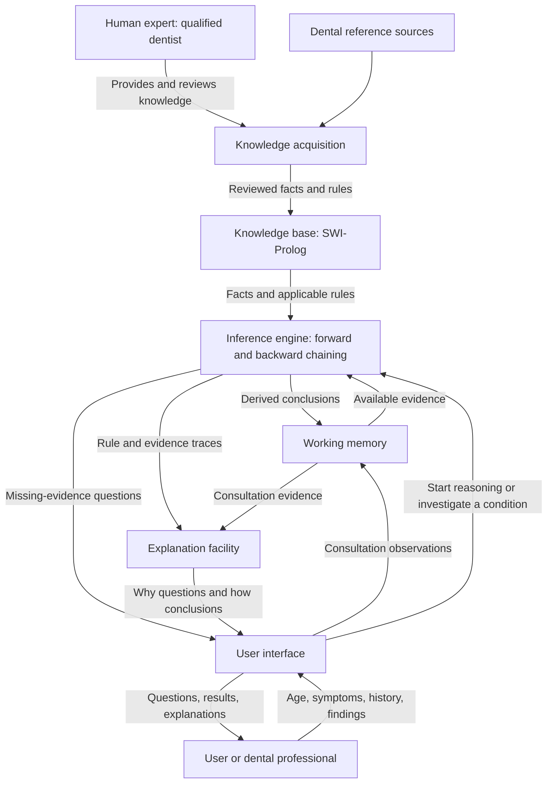

# DentalExplain

## Project proposal

- **Full name:** DentalExplain — An Explainable Dental Diagnosis Expert System
- **Repository:** [vishwajayawickrama/dental-expert-system](https://github.com/vishwajayawickrama/dental-expert-system)
- **Course:** CM3321 — Logic Programming and Artificial Cognitive Systems
- **Status:** Initial proposal; application implementation has not started.
- **Updated:** 28 September 2026

DentalExplain will assess common tooth-pain and gum-symptom presentations using an explainable, rule-based expert system. SWI-Prolog will implement both the knowledge base and inference engine. The selected desktop interface is Java Swing, integrated through JPL. See the [architecture document](architecture.md) for component responsibilities and macOS/Windows packaging.

## 1. Assignment requirements and deliverables

| Requirement | Planned response |
| --- | --- |
| Use an expert-system shell or native implementation | Native rule-based implementation in SWI-Prolog. |
| State a specific domain and clear scope | Tooth pain and gum symptoms across age groups, as defined below. |
| Explain expert-system anatomy | Block diagram and component descriptions in Section 4. |
| Identify the human expert | Qualified dentist providing and reviewing knowledge; participation pending. |
| Demonstrate forward and backward chaining | Explicit implementations over a shared rule base, with visible traces. |
| Show why answers are produced | Evidence, fired rules, intermediate conclusions, and age-dependent applicability. |
| Provide sufficient knowledge | Agreed target: 25 meaningful rules and 40 distinct authored domain facts. |
| Demonstrate correct operation | Automated reasoning tests and recorded consultation and packaging tests. |
| Submit a runnable application, beyond screenshots | Executable or runnable package appropriate to the selected platform. |
| Supply a user manual | Installation, consultation workflow, explanations, reset, and troubleshooting. |
| Do not build using Python | No Python application, inference engine, knowledge base, or integration layer. |

The repository currently contains this proposal and the [selected architecture](architecture.md). The application, knowledge base, full manual, screenshots, executable, and test results are later deliverables.

## 2. Specific domain and scope

**Domain:** Dental diagnostic decision support for common tooth pain and gum symptoms in children, adolescents, and adults. The system is not restricted to educational use or to adults.

Consultations will collect age and use it to select relevant questions and rules. Where relevant, they will also collect whether the affected tooth is primary or permanent, or whether dentition is mixed. Age alone must not substitute for supplied dentition information or examination findings.

### Included information and behavior

- Reported tooth pain: location, duration, triggering factors, persistence, and associated symptoms.
- Gum symptoms: bleeding, swelling, tenderness, and other findings supported by the reviewed knowledge base.
- Relevant dental history and explicitly supplied examination findings. The system will distinguish reported symptoms from findings entered by a dental professional.
- Age-appropriate candidate conditions, additional questions needed to evaluate them, and explanations of supported conclusions.
- An explicit outcome when evidence is incomplete, contradictory, or insufficient to support a condition.

The initial condition catalogue will focus on decay-related tooth pain and gum inflammation or periodontal disease. These are starting research areas, not approved diagnostic rules. [NIDCR's tooth-decay overview](https://www.nidcr.nih.gov/health-info/tooth-decay) and [gum-disease overview](https://www.nidcr.nih.gov/health-info/gum-disease) provide initial background; detailed diagnostic distinctions and pediatric applicability still need appropriate dental sources and expert review.

### Excluded scope

Orthodontic planning, oral cancer diagnosis, treatment prescribing, image interpretation, and management of every possible dental disorder are outside the initial scope. Results will support dental decision-making and identify their evidence basis; the proposal does not establish clinical validation or authority for autonomous diagnosis.

The final supported condition list, age-group boundaries, required findings, and behavior for urgent presentations remain pending dental-source research and expert review. No arbitrary age thresholds or clinical certainty percentages are established here.

## 3. Human expert and knowledge acquisition

The intended human expert is a **qualified dentist**, with pediatric knowledge or additional pediatric review for rules affecting children. The expert's name, qualifications, involvement, and review dates are **pending**. No expert consultation or clinical validation has taken place for this proposal.

The planned acquisition process is:

1. Research the bounded domain and prepare questions about symptom distinctions, age, dentition, required findings, and ambiguous cases.
2. Ask the dentist to explain how candidate conditions are supported or excluded and what additional evidence is needed.
3. Translate approved knowledge into declarative facts and identifiable rules in Prolog.
4. Record each fact's source and each rule's identifier, purpose, premises, conclusion, source, and review status.
5. Have the expert review the knowledge and expected outcomes for representative cases; revise and retest when knowledge changes.

### Knowledge-base size and counting

The agreed target is **25 meaningful rules and 40 distinct authored domain facts**. The original assignment discussion indicated that 20 rules and 20 facts would be insufficient; the agreed target increases both counts.

| Item | Meaning | Counts toward the target? |
| --- | --- | --- |
| Domain fact | An authored declarative statement about the domain, such as a reviewed condition classification or applicability relationship. | Yes, toward 40 facts. |
| Rule | A substantive relationship that derives a conclusion from premises. | Yes, toward 25 rules. |
| Consultation observation | A particular person's entered age, symptom, history, or finding. | No. |
| Derived consultation conclusion | An inference produced during one consultation. | No. |
| Test fixture or duplicate statement | Repeated sample input, duplicated knowledge, or padding. | No. |

The eventual implementation must report both authored counts and their coverage. Rule identifiers, labels, and source metadata are not additional medical facts. The 25 rules and 40 facts are targets, not existing content or proof of clinical completeness.

## 4. Expert-system anatomy

| Component | Responsibility |
| --- | --- |
| Human expert | Supplies domain reasoning and reviews its correctness and age applicability. |
| Knowledge acquisition | Converts sourced and reviewed knowledge into facts and rules with provenance. |
| Knowledge base | Stores reusable domain knowledge; independent of interface technology. |
| Working memory | Holds one consultation's observations and derived conclusions; cleared on reset. |
| Inference engine | Applies the shared rules using forward or backward reasoning. |
| Explanation facility | Uses actual evidence and reasoning traces to explain results and questions. |
| User interface | Collects information and presents questions, conclusions, and explanations. |

The interface exchanges structured consultation information with Prolog. Diagnostic decisions remain in Prolog rather than being duplicated in JavaScript, Java, or C++.

## 5. Inference and explanations

### Forward chaining: evidence to conclusions

Start with entered age, symptoms, history, and findings in working memory. Identify rules whose premises are satisfied, derive their conclusions, and repeat until no new conclusions follow. Record each fired rule and its supporting evidence. Prevent duplicate conclusions and repeated firing from causing an endless loop.

### Backward chaining: candidate condition to evidence

Start with a candidate condition. Find rules capable of supporting it, then recursively check their premises against working memory or other rules. Ask for missing information when it can be supplied by the user; do not treat an unknown answer as a negative answer. Record successful reasoning, unmet premises, and why each question was needed.

Prolog normally uses goal-directed execution. Calling ordinary Prolog predicates alone does not demonstrate a separate forward-chaining engine; forward chaining must be implemented explicitly.

### Shared knowledge and explainable output

Both modes will use the same authored rules and facts. For the same complete evidence, they should agree on whether a supported candidate conclusion follows, although their question order and traces may differ.

Each result should display the conclusion, supplied evidence, applicable rule identifiers, intermediate conclusions, relevant age or dentition restrictions, and remaining uncertainty. Each question should explain which candidate or rule needs its answer. Explanations must come from the recorded reasoning, rather than generic text added afterward. Conflicting evidence or unsupported conclusions must be visible rather than forced into a diagnosis.

## 6. Interface options

The comparison below records the alternatives considered. **Java Swing with JPL is selected**, with macOS and Windows desktop packages planned. The [architecture document](architecture.md) explains this decision and the runtime dependencies.

| Option | Advantages | Disadvantages | Integration and runnable delivery |
| --- | --- | --- | --- |
| Local web interface | Flexible consultation and explanation screens; familiar browser interaction; no separate language bridge needed. | Requires a local server, browser launch, port handling, and reliable server shutdown. | SWI-Prolog serves HTML/CSS/JavaScript and structured requests; distribute server, assets, runtime, and launcher. |
| Java Swing/JavaFX | Conventional desktop UI; Java packaging tools; suitable for structured forms. | JPL adds native-library configuration; JavaFX adds its own dependencies; more packaging components. | Query Prolog through JPL; bundle Java runtime, application, Prolog runtime, and matching JPL native libraries. |
| C++/Qt | Native desktop application; extensive GUI controls; direct Prolog embedding. | More build configuration, platform-specific dependency work, and native integration complexity. | Initialize SWI-Prolog through its C++ interface; deploy application with Qt and Prolog dependencies. |
| Prolog XPCE | GUI and reasoning written in Prolog; fewer language boundaries. | Less flexibility for contemporary UI design; GUI runtime availability must be checked. | Use XPCE forms and controls calling the same reasoning predicates; package required Prolog/XPCE resources. |
| Terminal interface | Smallest implementation; useful for debugging, automated demonstrations, and visible traces. | Less convenient consultation experience; limited presentation for the final demonstration. | Implement question prompts and explanation output in Prolog; launch through a script or packaged executable. |

### How to implement and package each option

**Local web interface — alternative, not selected:** Use SWI-Prolog's [HTTP server libraries](https://www.swi-prolog.org/pldoc/man?section=httpserver) to serve the interface and handle consultation requests. Keep consultation state isolated and bind the service to the local machine. Supply startup, browser-opening, and shutdown behavior. Package the server using [saved-state/executable support](https://www.swi-prolog.org/pldoc/man?predicate=qsave_program/2), include assets and required libraries, and test the delivered bundle. A browser interface does not require public website hosting.

**Java Swing — selected:** Use [JPL](https://github.com/SWI-Prolog/packages-jpl) to call Prolog and map results and traces into Swing UI models. JPL uses native integration, so a Java runtime alone is insufficient. Use [Oracle's jpackage guidance](https://docs.oracle.com/en/java/javase/25/jpackage/packaging-overview.html) to create an application image or installer with the Java runtime, then include compatible Prolog/JPL libraries and verify library loading. JavaFX remains an alternative; Swing is selected for the initial application.

**C++/Qt:** Build forms and explanation views in Qt, initialize an embedded Prolog engine, and call reasoning predicates through the [SWI-Prolog C++ interface](https://www.swi-prolog.org/pldoc/man?section=cpp2). Configure the compiler and linker for Prolog, deploy Qt and Prolog runtime dependencies, and verify their discovery on a clean target machine.

**XPCE:** Build dialogs, questions, results, and explanation views using the [SWI-Prolog native GUI library](https://www.swi-prolog.org/packages/xpce/). Call the common inference predicates directly and package the saved program with its GUI runtime resources. Check the selected distribution's GUI support on each intended platform.

**Terminal:** Build a Prolog consultation loop with validated prompts, reasoning-mode selection, traces, and reset/exit commands. Use it as a development interface or final interface if chosen; package with the same platform-specific Prolog executable approach.

### What counts as a runnable deliverable?

| Artifact | Meaning |
| --- | --- |
| Shell or batch script | Launches commands; normally depends on installed tools or bundled runtime files. |
| Java `.jar` | Java application archive; requires Java and, for this project, Prolog/JPL dependencies. |
| Executable | Platform-specific runnable program; may still require DLLs, shared libraries, and assets. |
| Installer | Installs an application and dependencies; is distinct from the installed application executable. |
| macOS application bundle | A macOS launchable package; not a Windows `.exe`. |

SWI-Prolog's [Windows executable guide](https://www.swi-prolog.org/FAQ/WinExe.md) describes creating an `.exe` and distributing required DLLs. An `.exe` is not automatically a dependency-free single file. Java's `jpackage` also requires building native package formats on the target platform. Windows delivery must therefore be built and tested on Windows or a suitable Windows build environment; a successful macOS run does not verify it.

The final demonstration should include the actual runnable artifact and its required dependencies, installation/launch instructions, and a complete consultation with explanations. Screenshots supplement that demonstration.

## 7. Test and acceptance plan

Use [SWI-Prolog PlUnit](https://www.swi-prolog.org/pldoc/package/plunit.html) for reasoning tests, with manual interface and delivered-package checks. Expert-reviewed fixtures must establish diagnostic expectations before results are marked correct.

For every test record: test ID, input age/dentition and evidence, reasoning mode, expected conclusion or question, expected rule/evidence trace, actual result, pass/fail status, and knowledge-base version. Actual outcomes are currently **not run**.

| Scenario | Expected behavior to verify | Current status |
| --- | --- | --- |
| Supported condition | Each finalized condition has a reviewed positive case and a discriminating negative case; expected rules support the result. | Not run |
| Age-dependent reasoning | Paired cases with changed age use the reviewed age restrictions and explain any changed result. | Not run |
| Age boundaries | Test values immediately below, at, and above each approved boundary. | Not run |
| Missing age or dentition | Ask for required information or report insufficient evidence; do not assume adulthood or tooth type. | Not run |
| Overlapping symptoms | Preserve supported alternatives and request distinguishing evidence where available. | Not run |
| Incomplete evidence | Identify unmet premises and avoid presenting an unsupported conclusion as established. | Not run |
| Contradictory evidence | Expose the conflict and request correction or clarification. | Not run |
| No supported conclusion | Return an explicit insufficient-evidence or outside-scope outcome with an explanation. | Not run |
| Consultation reset | Clear previous observations and derived conclusions; no evidence leaks into the next case. | Not run |
| Chaining agreement | Both modes agree on candidate support when given identical complete evidence. | Not run |
| Explanation correctness | Every claimed fired rule and supporting observation appears in the actual trace; question reasons match unmet premises. | Not run |
| Termination and repeated input | Forward reasoning terminates; repeated evidence does not create duplicate conclusions or loops. | Not run |
| Runnable delivery | Launch the packaged application on a clean target machine, complete a case, reset, and exit successfully. | Not run |

Acceptance requires the agreed authored knowledge counts, reviewed condition coverage, working demonstrations of both chaining modes, trace-based explanations, passing recorded tests, a runnable package, and a usable manual. Until clinical review occurs, software test success alone must not be described as clinical validation.

## 8. User manual outline

The full manual will be produced alongside the application and contain:

1. **Purpose and supported scope:** conditions, age groups, required findings, and meaning of outputs.
2. **Installation:** supported operating systems, prerequisites or bundled dependencies, and setup steps.
3. **Launch and exit:** platform-specific startup instructions and clean shutdown.
4. **Start a consultation:** enter age, dentition where relevant, symptoms, history, and available findings; indicate unknown answers.
5. **Reasoning modes:** run forward chaining and investigate candidates through backward chaining.
6. **Read results:** inspect conclusions, alternatives, unmet evidence, rule traces, and age-related explanations.
7. **Reset:** start a fresh consultation without previous evidence.
8. **Troubleshooting:** missing runtime or native libraries, server/port issues for a web UI, invalid inputs, and incomplete evidence.
9. **Worked examples:** reviewed cases showing inputs, results, and explanations.

## 9. Decisions and next steps

| Item | Status |
| --- | --- |
| Repository name | Agreed: `dental-expert-system`. |
| Application name | Proposed: DentalExplain. |
| Domain | Agreed: tooth pain and gum symptoms across age groups. |
| Reasoning and knowledge technology | Agreed: SWI-Prolog; no Python implementation. |
| Knowledge-base target | Agreed: 25 meaningful rules and 40 authored domain facts. |
| Interface | Selected: Java Swing with JPL integration. |
| Delivery platform and executable format | Planned: macOS `.app` and Windows application with an `.exe` launcher, bundling Java and Prolog/JPL dependencies; optional Windows installer. Exact supported versions and architectures remain pending. |
| Human expert and clinical review | Pending. |
| Exact conditions, age boundaries, and rules | Pending source research and expert review. |
| Application, executable, full manual, and test results | Not implemented. |

Next, verify Java/JPL integration and packaging on the target platforms, establish the reviewed condition catalogue and age/dentition model, acquire the knowledge, and then implement and validate the system. This proposal introduces no implemented API or clinical rule set.
