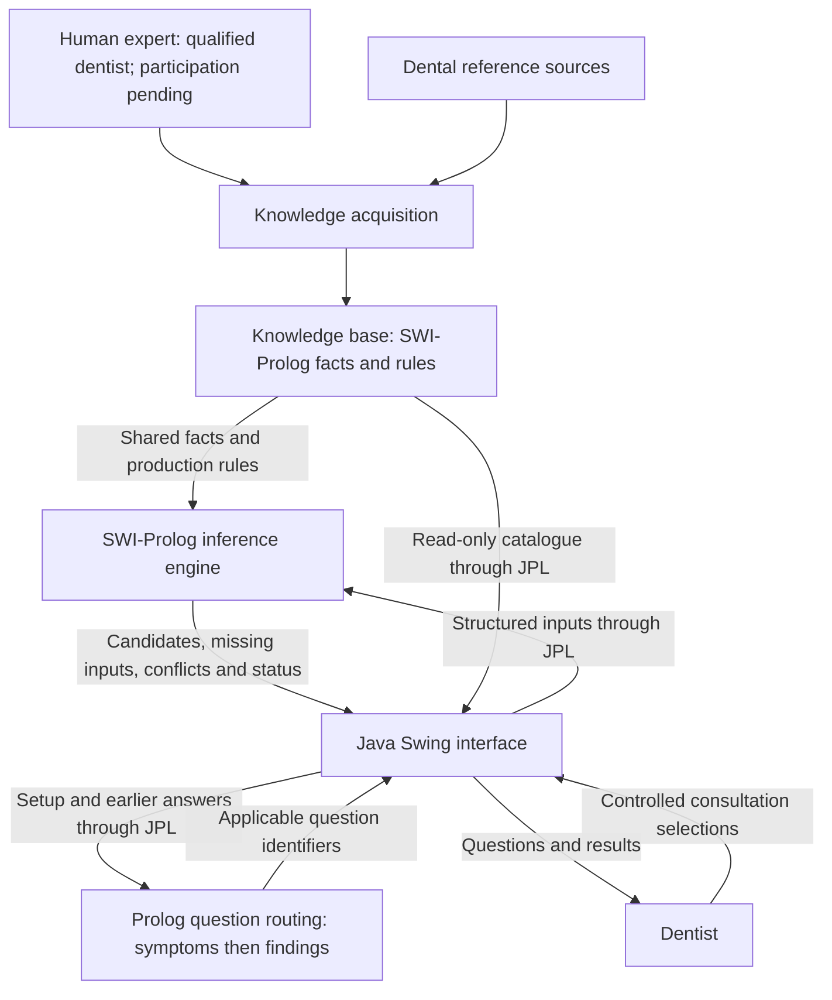

# DentalExplain

## Project proposal

- **Full name:** DentalExplain — A Dental Diagnosis Expert System
- **Repository:** [vishwajayawickrama/dental-expert-system](https://github.com/vishwajayawickrama/dental-expert-system)
- **Course:** CM3321 — Logic Programming and Artificial Cognitive Systems
- **Status:** First dentist-only desktop implementation. Expert identity, participation and clinical validation remain pending.
- **Updated:** 29 September 2026

DentalExplain assesses common tooth-pain and gum-symptom presentations using native SWI-Prolog rules and facts, with Java Swing integrated through JPL. The first deliverable targets Apple Silicon macOS. See the [architecture](architecture.md), [20 cases](test-cases.md), [user manual](user-manual.md) and [actual verification](verification.md).

## 1. Assignment requirements and deliverables

| Requirement | First implementation |
| --- | --- |
| Expert-system shell or native implementation | Native SWI-Prolog knowledge and inference modules. |
| Specific domain and scope | Dentist decision support for common tooth pain and gum symptoms across age groups. |
| Expert-system anatomy | Block diagram below and detailed architecture. |
| Human expert | Qualified dentist's knowledge-acquisition and validation role; identity/participation pending. |
| Forward chaining only | Evidence-driven fixed-point processing; this decision replaces the earlier requirement for both methods. |
| Knowledge size | Exactly 25 meaningful production rules and 30 authored domain facts. |
| Tests | 20 synthetic acceptance cases and additional boundary, engine and interface checks. |
| Runnable deliverable | Development JAR and bundled macOS `.app` with native launcher and icon. |
| User manual | Installation, consultation, knowledge viewing, saving, reset and troubleshooting. |
| No Python implementation | Java, Prolog and shell only. |

## 2. Specific domain and scope

**Domain:** Dental diagnostic decision support for common tooth pain and gum symptoms in children, adolescents and adults. The interface is intended for dentists, who enter reported symptoms and explicitly supplied examination findings. This is not restricted to an educational or adult-only domain.

The supported candidates are **dental caries, reversible pulpitis, symptomatic irreversible pulpitis, gingivitis and periodontitis**. Age is captured using five groups (0–5, 6–12, 13–17, 18–64 and 65–120 years, or Unknown); dentition, affected tooth type and root maturity are supplied independently. No diagnosis is inferred from chronological age alone. Primary/immature teeth use appropriate question applicability and separate rule branches; these clinical rules require dentist review. Age bands describe context and are not diagnostic thresholds.

Setup captures age group, dentition, affected tooth type and region. Step 1 collects reported pain, pain triggers/persistence, spontaneous/sleep/biting pain, combined gum symptoms, combined warning signs and jaw clicking. Step 2 collects applicable tooth findings, root maturity/thermal response, percussion/apical findings, plaque, periodontal measurements, previous-destruction history and loss-pattern follow-ups. Numeric findings use predefined measurement dropdowns. The dentist interprets examinations and images before entering their findings.

The application returns supported candidates, requests missing inputs, identifies conflicts, or reports outside-scope/no-supported-conclusion outcomes. Supported findings may coexist. All clinical inputs use dropdowns, radio buttons or checkboxes; no free-text clinical entry is allowed. Unknown, No, None and Not applicable retain distinct meanings. The shared catalogue defines every permitted mapping and Prolog controls applicability through `active_questions/3`. It contains 30 questions: 4 setup, 9 symptoms and 17 examination findings. FDI selectors and unused questions have been removed.

Orthodontic planning, oral cancer diagnosis, treatment prescribing, image interpretation, knowledge editing, autonomous clinical diagnosis, patient-record persistence and Windows packaging are outside this first implementation. Swelling, drainage or fever requires assessment beyond the five-condition catalogue. Full urgent-care and dental differential diagnosis are not implemented.

Clinical sources include [NIDCR tooth decay](https://www.nidcr.nih.gov/health-info/tooth-decay), [AAE terminology](https://www.aae.org/specialty/wp-content/uploads/sites/2/2017/07/aaeconsensusconferencerecommendeddiagnosticterminology.pdf), [AAPD pulp guidance](https://www.aapd.org/media/Policies_Guidelines/BP_PulpTherapy.pdf), [AAP gum disease](https://www.perio.org/for-patients/gum-disease-information/), and [EFP classification guidance](https://www.efp.org/fileadmin/uploads/efp/Documents/Campaigns/New_Classification/Guidance_Notes/report-02.pdf). Sources inform the provisional patterns; they do not constitute approval of this software's rules.

## 3. Human expert and knowledge acquisition

A **qualified dentist**, with pediatric expertise or additional pediatric review, should supply criteria, review question applicability, verify rule combinations and validate expected results. Expert name, qualifications, participation and review dates are **pending**. No completed expert consultation or clinical validation is claimed.

The process is source research → draft facts/rules/questions → dentist review → revision → repeat software and clinical validation. Each fact has an identifier, domain statement, description, source and review status. Each rule has identifiable premises, conclusion and source; its purpose is documented in the architecture. All clinical knowledge is currently pending review.

### Knowledge-base size and counting

The agreed implementation target is **25 rules and 30 distinct authored domain facts**, replacing the earlier 40-fact proposal. The original assignment discussion indicated that 20 rules and 20 facts would be insufficient. This implementation increases both counts, without claiming that counts establish clinical completeness.

| Item | Counts toward the target? |
| --- | --- |
| Authored reusable domain statement (`domain_fact/5`) | Yes: 30 facts. |
| Production rule deriving a pattern or candidate (`rule/5`) | Yes: 25 rules. |
| Consultation observation or per-call intermediate deduction | No. |
| Question schema, label, identifier or source metadata | No. |
| Synthetic test fixture or duplicate data | No. |

## 4. Expert-system anatomy

| Component | Responsibility and information flow |
| --- | --- |
| Human expert | Supplies knowledge and reviews source interpretation, clinical combinations and pediatric applicability. |
| Knowledge acquisition | Translates source/expert knowledge into reusable Prolog records with provenance. |
| Knowledge base | Stores facts, shared production rules and the separate question schema. |
| Inference engine | Validates current evidence and processes intermediate deductions within the assessment call using forward chaining. |
| JPL integration | Exchanges structured terms between Java and embedded SWI-Prolog. |
| Interface | Collects predefined inputs, preserves navigation, presents outcomes and provides read-only knowledge viewing. |

## 5. Inference and results

Forward chaining starts from supplied observations and applies satisfied rules until a fixed point, deduplicating conclusions. It fits the evidence-first consultation, assesses the full catalogue, and permits multiple candidates without asking the dentist to nominate a diagnosis. This decision replaces the earlier requirement for both methods. A further forward pass propagates missing prerequisites through unblocked rules until stable; it does not recursively prove goals.

Unknown or Not applicable findings do not satisfy required premises. A known failing premise blocks a rule. Results list candidate conditions and missing fields, without unsupported certainty percentages. The system returns no treatment instructions. Primary-tooth irreversible-pulpitis candidates explicitly retain the possible overlap with necrosis.

## 6. Interface and executable choice

Java Swing is selected for its built-in native controls and reusable Java source, with JPL embedding SWI-Prolog. The [architecture comparison](architecture.md#1-technology-decision) records Java, C++/Qt, web, XPCE and terminal alternatives and their dependencies.

The development JAR requires the matching runtime files. The macOS application image bundles Java 21, Prolog 10.0.2/JPL, knowledge files and an icon. Windows requires a separate Windows build and native-dependency verification; cross-platform Java source does not make one dependency-free JAR.

## 7. Test and acceptance plan

The [20-case catalogue](test-cases.md) retains concrete reported symptoms and supplied findings, source references, expected/prohibited outcomes and review status. Its automated fixtures map checkbox selections and measurements to permitted values without introducing arbitrary age-based conclusions.

Forward chaining must support the target in each of the 14 diagnostic cases and return the correct six edge-case outcomes. Additional checks cover all five age groups, Unknown/missing groups, invalid boundary values, contradictory inputs, incomplete evidence, blocked rules, unsupported presentations, coexisting findings, termination, duplicate prevention and reset. UI checks cover controlled inputs, exclusive checkbox alternatives, hidden-field clearing, back navigation, keyboard access and stale-result rejection.

Actual outcomes are recorded in [verification.md](verification.md); software passes are separate from pending clinical approval. The delivered Mac image must launch by icon, resolve bundled resources from a path with spaces, complete consultations, save results and reset. Another-machine verification, Developer ID signing/notarization and Windows delivery remain follow-up work.

## 8. User manual

The [manual](user-manual.md) describes packaged launch and developer commands, four-field setup, two adaptive questionnaire steps, forward-only assessment, result interpretation, editing, saving, new consultations, knowledge browsing and troubleshooting.
