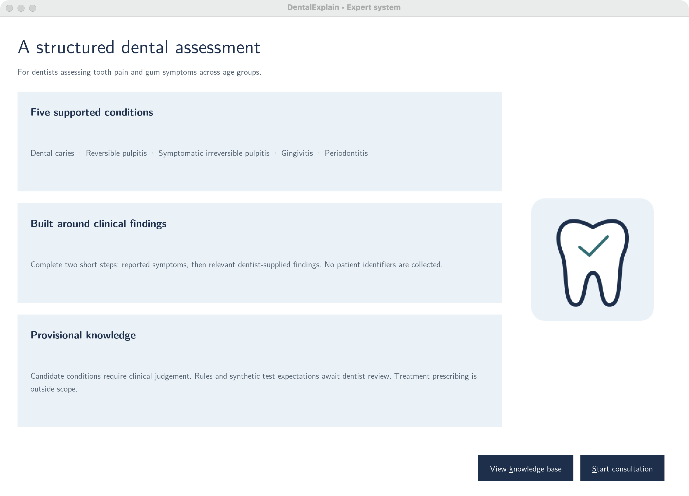
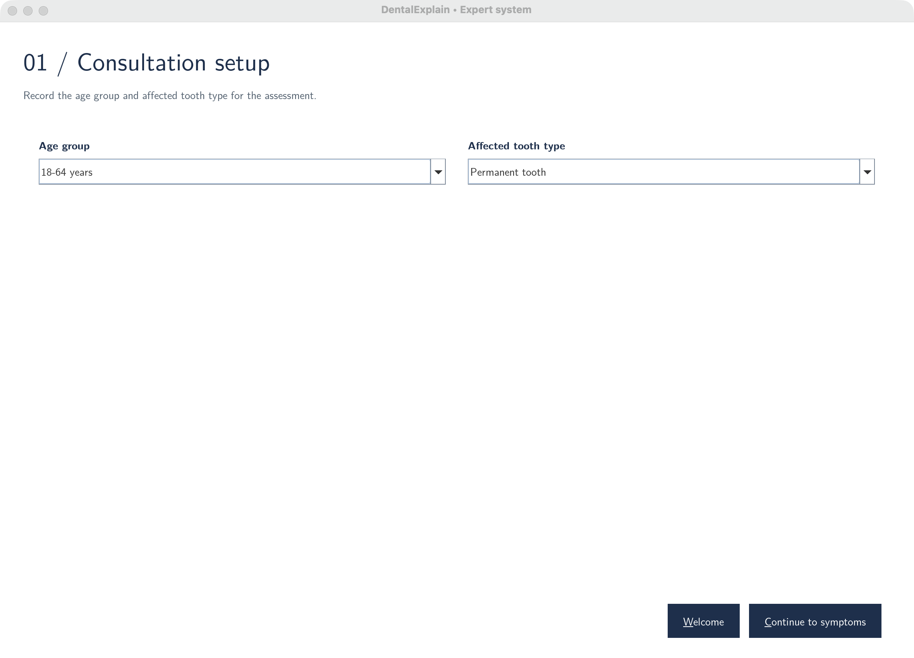
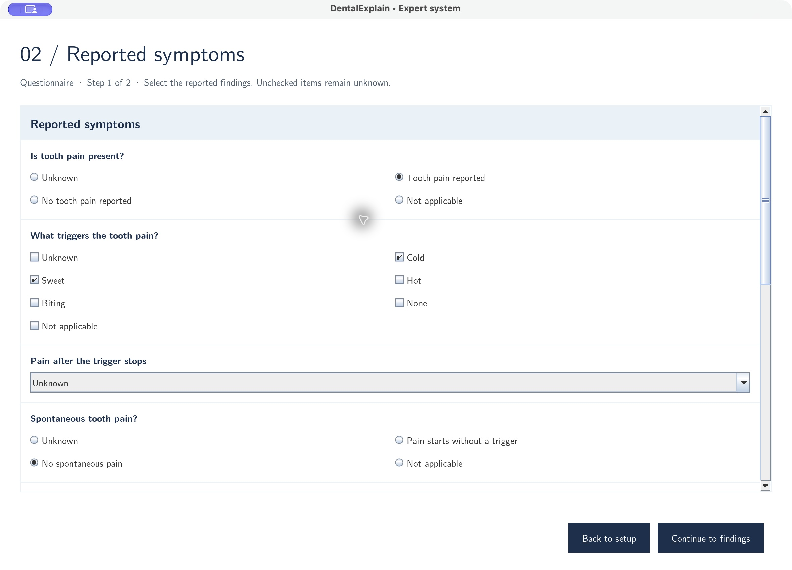
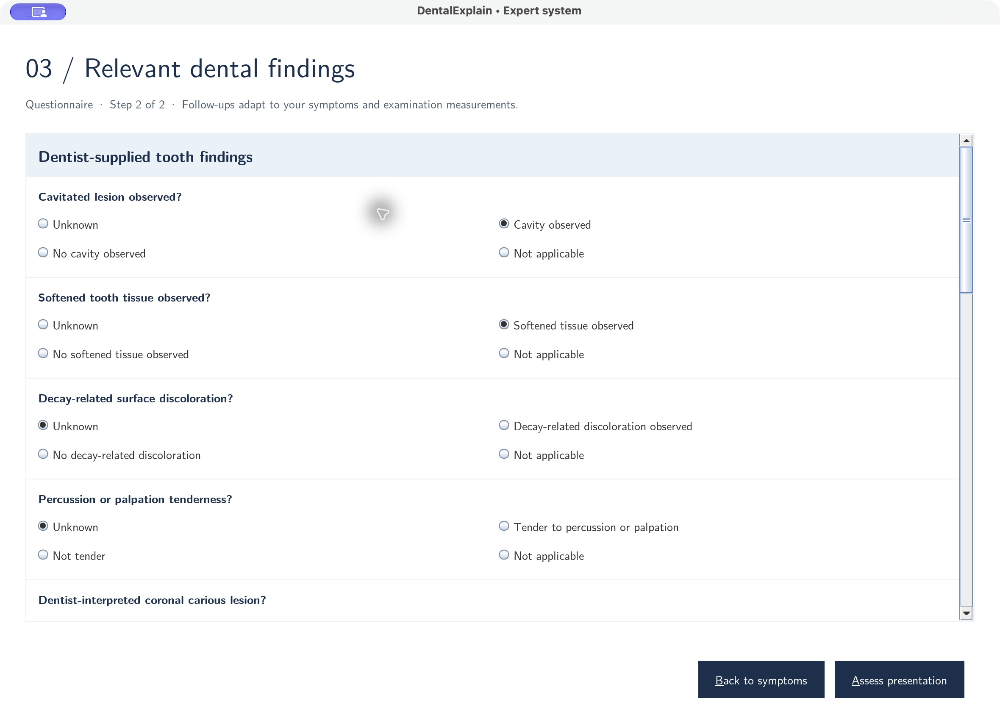
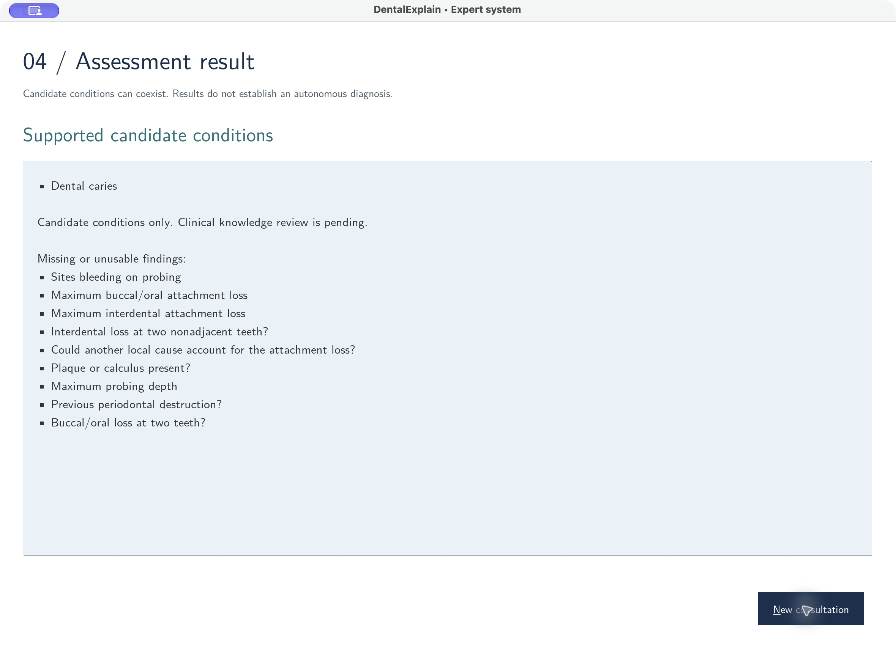
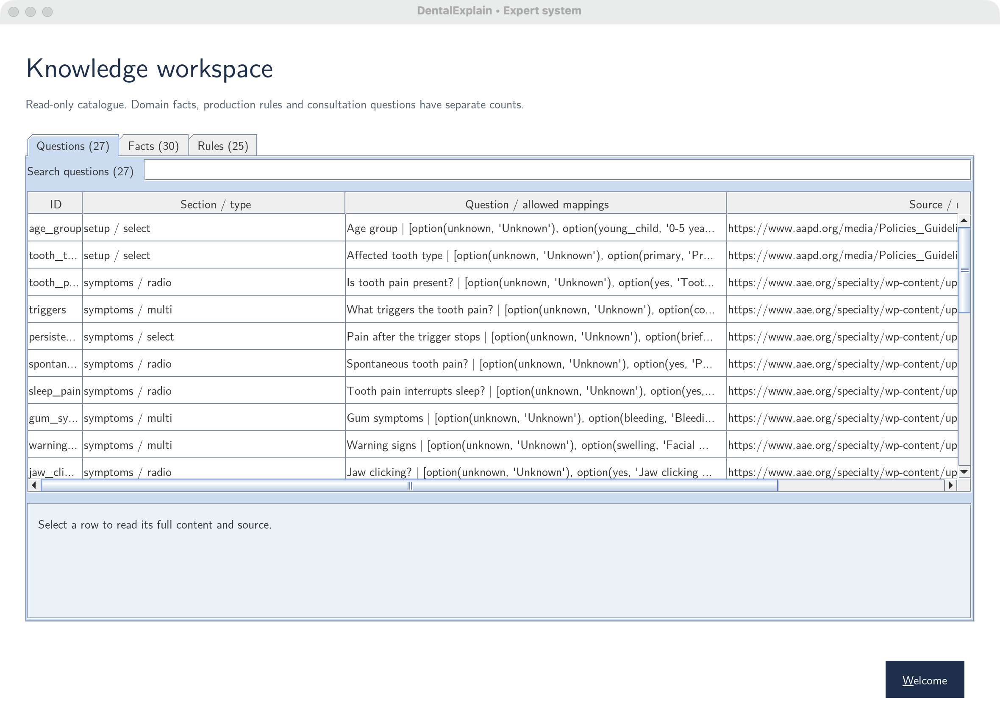

# Abstract

DentalExplain is a native desktop expert system for assessing common tooth-pain and gum-symptom presentations from predefined consultation answers and dentist-supplied examination findings. The application supports five candidate conditions: dental caries, reversible pulpitis, symptomatic irreversible pulpitis, gingivitis and periodontitis. Java Swing provides the interface, while SWI-Prolog 10.0.2 performs validation, adaptive question routing and explicit forward chaining through JPL.

The knowledge base contains 30 authored domain facts and 25 production rules. A separate catalogue defines 30 questions: four setup fields, nine reported-symptom questions and 17 examination questions. The consultation uses two adaptive questionnaire steps, preserves applicable answers during Back navigation and excludes answers when their parent makes them inapplicable. Inference evaluates the complete condition catalogue and permits coexisting candidates. Unknown information remains distinct from explicit absence.

Twenty synthetic acceptance cases and 43 Prolog checks pass. Java integration and interface checks, together with bundled-runtime verification, pass on Apple Silicon macOS, Windows x64 and Ubuntu 24.04 x64. Manual desktop verification was performed on macOS; Windows and Linux verification was automated. The submission includes runnable platform packages and interface and Prolog source. Kushala Jayawickrama, a final-year fifth-year Dental Surgery undergraduate at the University of Peradeniya, is the project's human expert. The questionnaire was conducted with her, and her input together with published dental sources informed the facts and rules. Clinical validation remains pending.

# 1 Introduction

## 1.1 Background

An expert system represents a specific area of knowledge as reusable facts and rules and applies an inference procedure to a supplied case. DentalExplain uses this approach for a defined set of dental presentations. Rather than accepting unstructured descriptions, it collects reported symptoms and examination findings through predefined controls, then evaluates explicit production rules.

Dental symptoms can overlap, while a condition such as early caries may be present without reported pain [1]. A useful consultation therefore needs both symptom information and objective findings. DentalExplain keeps these groups separate and retains basic caries and periodontal observations even when the user reports no pain or gum symptoms.

## 1.2 Problem statement

The problem addressed is how to provide a consistent, runnable expert-system consultation for five common dental conditions without ambiguous free-text inputs or an unnecessarily long questionnaire. The system must preserve uncertainty, identify missing or conflicting information, and evaluate evidence without requiring the user to select a diagnosis in advance.

DentalExplain addresses this problem through a shared Prolog question catalogue, adaptive routing and forward fixed-point reasoning. Its outputs are supported candidates and assessment statuses. It does not make an autonomous clinical diagnosis. The intended user is a dentist who enters findings obtained and interpreted outside the application.

# 2 Domain Definition and Scope

## 2.1 Specific domain

The domain is dental diagnostic decision support for common tooth pain and gum symptoms across age groups, using reported symptoms, dentition and explicitly supplied dental examination findings. The supported targets are dental caries, reversible pulpitis, symptomatic irreversible pulpitis, gingivitis and periodontitis.

Age is selected as 0-5, 6-12, 13-17, 18-64 or 65-120 years. These are consultation context groups, not diagnostic thresholds. Dentition and root maturity are supplied independently; the engine does not infer them from age.

## 2.2 Included scope

The consultation collects four setup fields, reported pain and gum symptoms, warning signs, caries observations, relevant pulp/apical findings and periodontal measurements. Pulpal branches distinguish supplied primary, immature permanent and mature permanent tooth findings. Periodontal rules use attachment-loss patterns and exclusion of other local causes [2-6].

The system supports multiple candidates where their premises coexist. It can return missing-input requests, input conflicts, invalid-input status, an outside-scope response or no supported conclusion. A read-only workspace exposes the separate question, fact and rule catalogues.

## 2.3 Excluded scope

Orthodontic planning, oral cancer diagnosis, treatment prescribing, image interpretation, patient-record persistence, result export and knowledge editing are excluded. Facial swelling, drainage or fever leads to the existing outside-scope response rather than a diagnosis within this five-condition catalogue. A full dental differential diagnosis and periodontal staging/grading are not implemented.

# 3 Knowledge Acquisition

## 3.1 Human expert and knowledge sources

Knowledge was acquired through a questionnaire conducted with the human expert and review of published dental sources. The expert's contribution and qualifications are recorded below.

- **Name:** Kushala Jayawickrama.
- **Qualification:** Final-year fifth-year Dental Surgery undergraduate.
- **University:** University of Peradeniya.
- **Contribution:** Her questionnaire input, together with published dental sources, informed the authored facts and production rules, including symptom distinctions, examination findings and dentition-related interpretation. The conducted questionnaire appears in Appendix B.
- **Knowledge sources:** NIDCR caries information, AAE diagnostic terminology, AAPD pediatric pulp guidance, AAP gum-disease information and EFP periodontal classification references [1-6].
- **Validation status:** Expert participation is confirmed; completed clinical validation is not claimed and remains pending. Her undergraduate qualification is not represented as qualified-dentist status.

## 3.2 Questionnaire and rule traceability

The human expert questionnaire is included in Appendix B. It contains 15 questions covering the five supported conditions, relevant examination findings, dentition, root maturity, uncertainty, conflicting evidence, warning signs and expected outputs. These are the questions conducted with Kushala, as confirmed by the project author. Responses, interview dates, signatures and completed approval are not reproduced or invented.

Each fact and production rule has an identifier, a source and a pending review status. Appendix C lists the implemented catalogue. For example, caries questions link to r01-r04, pulpal criteria to r05-r17 and periodontal criteria to r18-r25. This makes source interpretation and proposed expert review identifiable without adding an explanation facility to the application.

The acquisition process is source review, authored Prolog records, expert discussion, review of rule combinations and expected cases, revision where needed, and repeat verification. Recorded software test passes establish implementation behavior; clinical validation remains a separate review activity.

# 4 Expert System Architecture

## 4.1 Anatomy of the system


The user supplies consultation inputs through the User Interface and receives assessment results through the same interface. The Inference Engine applies knowledge from the Knowledge Base to those inputs. Questionnaire data from the Human Expert and published Dental Reference Sources flow through Knowledge Acquisition into the Knowledge Base. These arrows describe information flow, rather than a knowledge-editing screen.

## 4.2 Implemented components

| Component | Responsibility |
| --- | --- |
| User | Supply reported symptoms and dentist-supplied findings; interpret the returned assessment. |
| User Interface | Present setup, the two questionnaire steps, results and the read-only knowledge catalogue. |
| Inference Engine | Validate consultation inputs, apply forward chaining and identify supported candidates or missing information. |
| Knowledge Base | Store 30 domain facts, 25 production rules and a separate question catalogue with source and review metadata. |
| Human Expert | Contribute domain knowledge through the conducted questionnaire; clinical validation remains pending. |
| Dental Reference Sources | Supply published evidence for clinical concepts and diagnostic criteria. |
| Knowledge Acquisition | Translate expert questionnaire input and published sources into structured facts and rules. |

Consultation observations are passed into each assessment. Intermediate deductions remain within inference processing. The architecture includes no separate working-memory component, explanation facility or knowledge-editing interface. Implementation technologies are described in Section 7.

# 5 Knowledge Representation

## 5.1 Facts

The 30 authored domain facts are reusable statements represented by domain_fact/5. Each record contains an identifier, a structured domain term, a description, a source identifier and a review status. One example is:

```prolog
domain_fact(f07, applicable_dentition(caries,both),
  'Caries can occur in primary and permanent teeth.',
  nidcr, pending).
```

Some facts are explicitly queried through kb(...) premises. Others describe clinical concepts and provenance in the knowledge catalogue. They are not 30 patient observations. Question schemas, metadata, test data and per-call deductions do not inflate the authored fact count.

## 5.2 Production rules

The 25 rule/5 records contain an identifier, premise list, conclusion, source and review status. Equality and numeric comparisons test supplied findings; derived(...) requires an intermediate deduction; kb(...) checks an authored domain term. For example:

```prolog
rule(r01, [eq(cavity,yes),eq(soft_tissue,yes)],
  carious_lesion, nidcr, pending).
rule(r04, [derived(carious_lesion),
           kb(applicable_dentition(caries,both))],
  candidate(caries), nidcr, pending).
```

Rules r01-r04 concern caries. Rules r05-r17 form provoked-pain and pulpal patterns and apply tooth/root-specific branches. Rules r18-r25 form gingival inflammation and periodontal destruction patterns. The complete premises and conclusions appear in Appendix C.

## 5.3 Questions and consultation observations

The separate catalogue defines 30 questions with identifiers, stage membership, control types, labels, allowed values and applicability. Dropdowns are non-editable; radio and checkbox answers use question-specific wording. Labels map to stable Prolog atoms or predefined numbers. A submitted answer is represented as obs(Key,Value).

Unknown is the default and is not treated as No. Not applicable is separate but cannot establish a required premise. For checkbox groups, None explicitly records absence of all listed items. Selecting an item establishes only that finding; other unchecked items remain Unknown. Combined gum and warning-sign answers expand to the internal clinical observation identifiers before inference.

# 6 Inference Method

## 6.1 Forward chaining and justification

Forward chaining is the only implemented method. A consultation begins with evidence and seeks every supported candidate in the five-condition catalogue. This suits data-driven reasoning: the user need not nominate a suspected diagnosis, and different rule branches can support coexisting candidates. The decision replaces the earlier plan to provide both chaining methods.

The engine begins with an empty deduction set, scans every production rule and adds conclusions whose premises are satisfied. It sorts and deduplicates the combined set and repeats until the set stops changing. The finite conclusion vocabulary and duplicate prevention guarantee termination for this rule base.

## 6.2 Worked dental example

Consider TC06: an adult group, permanent tooth, mature roots, a supplied carious lesion, cold/sweet-provoked pain that stops promptly, no spontaneous or sleep-interrupting pain, no percussion/apical findings, no warning signs and a brief thermal response.

| Forward pass | Newly supported deductions | Relevant rules |
| --- | --- | --- |
| 1 | carious_lesion and provoked_pain | r02, r05 and r06 |
| 2 | candidate(caries) and brief_provoked_pain | r04 and r08 |
| 3 | reversible_pattern | r09 |
| 4 | candidate(reversible_pulpitis) | r12 |
| 5 | No further conclusions; fixed point reached | No new rule conclusion |

The returned candidates are Dental caries and Reversible pulpitis. Explicit negative findings are premises in r09, so an unanswered negative finding cannot silently satisfy that rule. This walkthrough describes the algorithm in the report; the interface does not display fired-rule traces.

## 6.3 Missing information and assessment statuses

After confirmed deductions settle, a second forward pass propagates unresolved prerequisite sets through unblocked rules until stable. A known contradictory premise blocks a rule and its missing-field requests. Unknown or Not applicable evidence remains unusable. Missing requests for internal checkbox findings map back to their public question, and hidden follow-ups point to an unanswered parent first.

Input validation, contradiction checks and outside-scope checks precede ordinary assessment. Missing age group requests completion. Otherwise the engine returns supported candidates, additional information needed, or no supported condition. Candidate outputs can also include missing findings for other unresolved conditions; this does not retract the supported candidates.

# 7 System Design and Implementation

## 7.1 Technology and execution boundary

Java 21 and Swing provide the native desktop interface. SWI-Prolog 10.0.2 performs reasoning through matching JPL Java/JNI libraries. Java Swing was selected for standard controls and a shared interface codebase. JPL still requires platform-specific native dependencies [7]. Windows and macOS application images use Java packaging tools [8]. The expert-system implementation uses Java, Prolog and shell scripts, with no Python inference or interface implementation.

The Java bridge constructs typed terms instead of concatenating user text into Prolog queries. The public assessment and routing interfaces are:

```prolog
assess(Observations,
  result(Status,CandidateIds,MissingQuestionIds,Messages)).
active_questions(Observations,Stage,QuestionIds).
```

Java calls Bridge.assess(answers) and Bridge.activeQuestions(answers,stage). Prolog validates identifiers, allowed values, duplicate keys and list shapes at the boundary. Catalog operations expose questions, facts, rules, condition labels, sources and knowledge version.

## 7.2 Adaptive consultation and lifecycle

Setup collects age group, dentition, tooth type and region. Step 1 collects reported symptoms; pain follow-ups appear when tooth pain is reported. Step 2 includes basic caries observations and periodontal measurements even without symptoms, then reveals follow-ups according to supplied findings. Mature-root thermal fields are shown only for an applicable painful permanent tooth with mature roots. Known warning signs or the jaw-only pattern bypass unnecessary examination questions.

Prolog controls applicability. Java clears and excludes inapplicable child answers, while preserving applicable selections across Back navigation. Initialization, routing and reasoning run on one background executor. Swing updates occur on the event-dispatch thread. Generation tokens discard callbacks from obsolete edits, navigation or reset [9].

Results provide New consultation as the only action. It clears selections and results and restores defaults. Back navigation remains available before assessment. Knowledge viewing is read-only; no editing or result-saving dialog is provided.

## 7.3 Executable and runtime dependencies

Application version 1.1.0 uses knowledge version 0.3.0. The submission contains a Windows x64 executable image, an Apple Silicon macOS app and a bundled Java package for Ubuntu 24.04 x64 desktops. Each retains Java, SWI-Prolog/JPL, knowledge files and legal notices. Users must keep complete application folders together.

The root launchers open those packages without compilation or separate Java/Prolog installation. The Java application JAR is shared code, but cannot run alone without its accompanying dependencies. Windows signing and macOS notarization remain pending; native platform packages are distinct from an installer.

## 7.4 Welcome and consultation setup



The welcome screen offers Start consultation and View knowledge base, identifies the supported conditions and describes the consultation flow.



Setup uses four non-editable dropdowns. Age group does not automatically determine dentition or diagnosis. The form retains its white background, internal padding and consistent Latin Modern Sans typography.

## 7.5 Reported symptoms and relevant findings



Step 1 separates reported symptoms from examination findings. Reporting tooth pain reveals trigger, persistence, spontaneous, sleep and biting questions. Checkbox special answers remain mutually exclusive with findings.



Step 2 presents applicable caries, pulp/apical and periodontal findings. Long forms scroll, while Back and Assess actions remain available outside the scroll area. Uncertainty keeps potentially relevant follow-ups available.

## 7.6 Results and knowledge workspace



Results display supported candidates and any additional requested findings. New consultation is the only result action. The screenshot represents a synthetic symptom-free caries assessment, separate from the pain-follow-up illustration.



Questions, Facts and Rules have separate counts. Search filters the active table, and selecting a row displays its full content and source. The workspace provides inspection rather than knowledge editing.

# 8 Testing and Evaluation

## 8.1 Testing strategy

The acceptance catalogue contains 14 diagnostic cases and six edge cases. Inputs are synthetic and mapped to predefined selections. Diagnostic cases require the target candidate without forcing mutually exclusive diagnoses. Edge cases cover missing age, invalid numeric age-group input, incomplete evidence, contradictory pain inputs, outside-scope presentation and reset. Full case inputs, expected responses and actual engine results appear in Appendix D.

Additional Prolog checks cover valid choices, malformed/removed identifiers, checkbox exclusivity, uncertainty, age groups, termination, duplicate prevention, blocked rules, routing and coexisting candidates. Java/JPL checks assess the same cases and 14 routed diagnostic cases. Swing checks cover 30 control schemas, Back navigation, hidden-answer clearing, results, reset and stale callbacks.

## 8.2 Automated results

| Check | macOS ARM64 | Windows x64 | Ubuntu 24.04 x64 |
| --- | --- | --- | --- |
| 20 forward acceptance cases | PASS | PASS | PASS |
| 43 Prolog checks | PASS | PASS | PASS |
| 20 JPL cases and 14 routed diagnostic cases | PASS | PASS | PASS |
| Controlled inputs and consultation lifecycle checks | PASS | PASS | PASS under Xvfb |
| Bundled Java launch from a path with spaces | PASS | PASS | PASS |
| Native launcher initialization | PASS app | PASS exe | Java launcher used |

These results are recorded in the successful cross-platform workflow on 29 September 2026 [10]. The current source retains the tested engine and application behavior. The report-data export separately assesses all 20 fixtures and records the actual candidates, messages and missing identifiers in Appendix D.

## 8.3 Desktop and submission verification

Manual desktop verification on macOS includes consultation navigation, result display, knowledge viewing and New consultation. Windows and Linux desktop behavior was checked automatically on hosted runners; a separate manual Windows/Linux consultation is not claimed. Screenshots in this report were captured from the current installed macOS application using synthetic selections.

The submission assembly verifies source inclusion, report files, three root launch scripts, complete runtime directories, executable permissions and SHA-256 checksums. Launch checks use extracted folders containing spaces. Recorded software results do not establish diagnostic accuracy in real patients; clinical knowledge and expectations remain pending review.

# 9 Conclusion

DentalExplain implements a runnable native expert system combining Java Swing with embedded SWI-Prolog through JPL. Its 30-question adaptive consultation collects controlled evidence in two steps, while 25 production rules and 30 authored domain facts support five candidate conditions through forward chaining.

The implementation preserves uncertainty, supports coexisting candidates and returns defined responses for incomplete, conflicting and unsupported inputs. The submission provides source, a platform-specific runnable package for each supported operating system and a user manual. Automated verification passes across the three target platforms, with manual macOS inspection. The human expert is identified and the conducted questionnaire is supplied in Appendix B; clinical review remains pending.

# References

[1] National Institute of Dental and Craniofacial Research. Tooth Decay. https://www.nidcr.nih.gov/health-info/tooth-decay

[2] American Association of Endodontists. AAE Consensus Conference Recommended Diagnostic Terminology. 2009. https://www.aae.org/specialty/wp-content/uploads/sites/2/2017/07/aaeconsensusconferencerecommendeddiagnosticterminology.pdf

[3] American Academy of Pediatric Dentistry. Pulp Therapy for Primary and Immature Permanent Teeth. https://www.aapd.org/media/Policies_Guidelines/BP_PulpTherapy.pdf

[4] American Academy of Periodontology. Gum Disease Information. https://www.perio.org/for-patients/gum-disease-information/

[5] Sanz M and Tonetti M. Periodontitis Guidance for Clinicians. European Federation of Periodontology, 2019. https://www.efp.org/fileadmin/uploads/efp/Documents/Campaigns/New_Classification/Guidance_Notes/report-02.pdf

[6] Chapple ILC et al. Periodontal health and gingival diseases and conditions on an intact and a reduced periodontium. Journal of Clinical Periodontology, 2018. https://www.efp.org/fileadmin/uploads/efp/Documents/Campaigns/New_Classification/Reports/Consensus_report__Workgroup_1__Chapple_et_al-2018-Journal_of_Clinical_Periodontology.pdf

[7] JPL. Deploying for users. https://jpl7.org/Deployment

[8] Oracle. Java 21 jpackage Packaging Overview. https://docs.oracle.com/en/java/javase/21/jpackage/packaging-overview.html

[9] Oracle. Concurrency in Swing. https://docs.oracle.com/javase/tutorial/uiswing/concurrency/index.html

[10] DentalExplain. Verified cross-platform workflow run, 29 September 2026, source commit 777ab83. https://github.com/vishwajayawickrama/dental-expert-system/actions/runs/36535968417

References accessed on 29 September 2026. Source identifiers used in Appendix C map as follows: nidcr [1], aae [2], aapd [3], aap [4], efp [5], efp_g [6].

# Appendix A User Manual

## A.1 Starting the distributed application

Extract DentalExplain-submission.zip completely before opening the app. Choose the launcher for your computer. The bundled runtimes mean Java and SWI-Prolog do not need separate installation. Keep the applications folder and all its contents intact; do not move only the executable or JAR.

| Computer | Launch from the extracted ZIP root |
| --- | --- |
| Windows x64 | Double-click Open-Windows.cmd. Alternatively, open DentalExplain.exe inside the applications/windows/DentalExplain folder. |
| Apple Silicon macOS | Double-click Open-macOS.command, or open applications/macos/DentalExplain.app. The app may be copied intact to Applications. |
| Ubuntu 24.04 x64 desktop | Open a terminal in the extracted folder and run ./Open-Linux.sh. A graphical desktop is required. |

If a Unix extraction tool removes executable permissions, run chmod +x Open-macOS.command on macOS. On Linux run chmod +x Open-Linux.sh applications/linux/DentalExplain/runtime/java/bin/java. Windows packages target x64; Intel Macs and other ARM targets are not provided. Windows signing and macOS notarization are pending; follow the computer owner's software policy if the operating system blocks a downloaded application.

Wait for the welcome screen before starting. An initialization error means the application runtime is unavailable; it is not a clinical result. The root scripts report missing application files. Restore the complete extracted package rather than replacing individual libraries.

## A.2 General consultation procedure

Choose Start consultation, supply setup details, complete Reported symptoms, then Relevant dental findings, and choose Assess presentation. Back to setup and Back to symptoms allow changes before assessment. Applicable selections remain; changing a parent clears dependent answers that become inapplicable.

Use Unknown for unavailable information. A negative answer explicitly records absence, while Not applicable cannot establish a diagnostic premise. In checkbox groups, None reported excludes every listed finding. An unchecked item remains Unknown unless None is selected. Use Tab and Shift-Tab to move between controls, arrows for predefined choices and Space for radio/checkbox controls.

## A.3 Example consultation for symptom-free caries

This example is synthetic. Choose age group 18-64 years, Permanent dentition, Permanent tooth and Single tooth. Continue to symptoms. Select No tooth pain reported, None reported for gum symptoms and warning signs, and No jaw clicking reported. Pain follow-ups stay hidden.

Continue to findings and select Cavity observed and Softened tissue observed. Record other findings only if actually supplied; leave unavailable information Unknown. Assess presentation. These findings support Dental caries under the implemented rules, and unresolved other conditions may produce additional missing-field requests.


## A.4 Example consultation with pain follow-ups

For a painful permanent tooth, report Tooth pain reported in Step 1. Trigger, persistence, spontaneous, sleep and biting questions appear. Select only the supplied findings. In Step 2, provide root maturity; a recorded thermal response becomes available for mature roots. The TC06 values in Appendix D support coexisting caries and reversible pulpitis candidates.

Measurements use predefined dropdowns: depth and attachment loss range from 0 to 15 mm in 0.5 mm steps, and bleeding on probing from 0% to 100% in 5% steps. Do not invent or round a finding just to select a rule-supporting value. Use Unknown for unavailable or unrepresentable measurements.

## A.5 Interpreting results and starting again

| Outcome | User action |
| --- | --- |
| Supported candidate conditions | Interpret the candidates with clinical judgement; more than one can be supported. |
| Additional information needed | Review the requested findings and start a fresh consultation with available evidence. |
| Conflicting or invalid selections | Start again with consistent predefined values. |
| Outside supported scope | Assess the presentation beyond the five-condition catalogue. |
| No supported conclusion | No rule-supported candidate follows; this does not exclude other dental conditions. |

The results screen offers New consultation only. It clears selections and the displayed result. Results cannot be edited or saved from this screen. Closing the app does not store the consultation.


## A.6 Knowledge viewing and troubleshooting

Choose View knowledge base from Welcome. Questions (30), Facts (30) and Rules (25) are separate read-only tabs. Search filters the active table. Select a row to inspect its content, source and review status; scroll to view long entries.

| Problem | Action |
| --- | --- |
| Missing runtime or native library | Restore the complete package, keeping application folders together. |
| Unsupported architecture | Use the supplied macOS ARM64, Windows x64 or Ubuntu x64 package. |
| Launcher cannot execute on Unix | Restore the executable permissions described in A.1. |
| Missing age group | Choose one of the five predefined groups before assessment. |
| Missing findings | Use only available evidence; do not turn Unknown into a negative answer. |
| Unexpectedly empty knowledge table | Clear the search filter and select the relevant tab. |

# Appendix B Human Expert Questionnaire

Human expert: Kushala Jayawickrama, final-year fifth-year Dental Surgery undergraduate, University of Peradeniya. Status: conducted questionnaire, confirmed by the project author. These 15 questions were asked of the human expert and informed the knowledge alongside published sources. Responses and interview dates are not reproduced; completed clinical approval is not claimed.

## B.1 Questionnaire questions

1. Which reported symptoms and dentist-supplied findings are most useful when assessing common tooth pain and gum symptoms within these five targets? Relevant knowledge: all rule groups.
2. Which combinations of cavitation, softened tissue, discoloration and radiographic findings support a caries candidate, including a painless presentation? Relevant rules: r01-r04.
3. How should brief cold- or sweet-provoked pain be distinguished from pain that persists after the stimulus stops? Relevant rules: r05-r08 and r14.
4. Which explicitly absent findings should be required before supporting the implemented reversible-pulpitis pattern? Relevant rules: r09-r12.
5. How should spontaneous pain, sleep interruption and lingering thermal pain contribute to a symptomatic irreversible-pulpitis candidate? Relevant rules: r13-r17.
6. What changes in question applicability and interpretation are needed for primary teeth compared with permanent teeth? Relevant facts: f07 and f14-f16; rules r10 and r15.
7. How should immature permanent roots affect pulp testing and the required supporting evidence? Relevant facts: f15; rules r11 and r17.
8. For mature permanent teeth, how should a brief, lingering or absent thermal response be interpreted alongside other findings? Relevant rules: r12 and r16.
9. Which combinations of plaque, bleeding, red/swollen gingiva and bleeding-on-probing measurements support gingival inflammation? Relevant rules: r18-r19 and r25.
10. What attachment-loss, probing-depth and previous-destruction findings are required for the implemented intact-periodontium gingivitis candidate? Relevant rule: r20.
11. How should interdental attachment loss at nonadjacent teeth support a periodontitis case definition? Relevant rules: r21 and r23.
12. How should buccal/oral attachment loss, pocket depth, affected-tooth count and alternative local causes be combined? Relevant rules: r22-r24.
13. How should missing, Unknown, Not applicable and contradictory findings affect the assessment and requests for further information? Relevant processing: boundary validation and forward missing-prerequisite propagation.
14. Which warning signs or jaw-only presentations should leave the supported scope, and is the current routing appropriate? Relevant processing: outside_scope checks.
15. Do the 20 synthetic cases and their expected coexisting candidates match the intended rule behavior, and which facts, premises or questions require revision before clinical validation? Relevant evidence: Appendices C and D.
